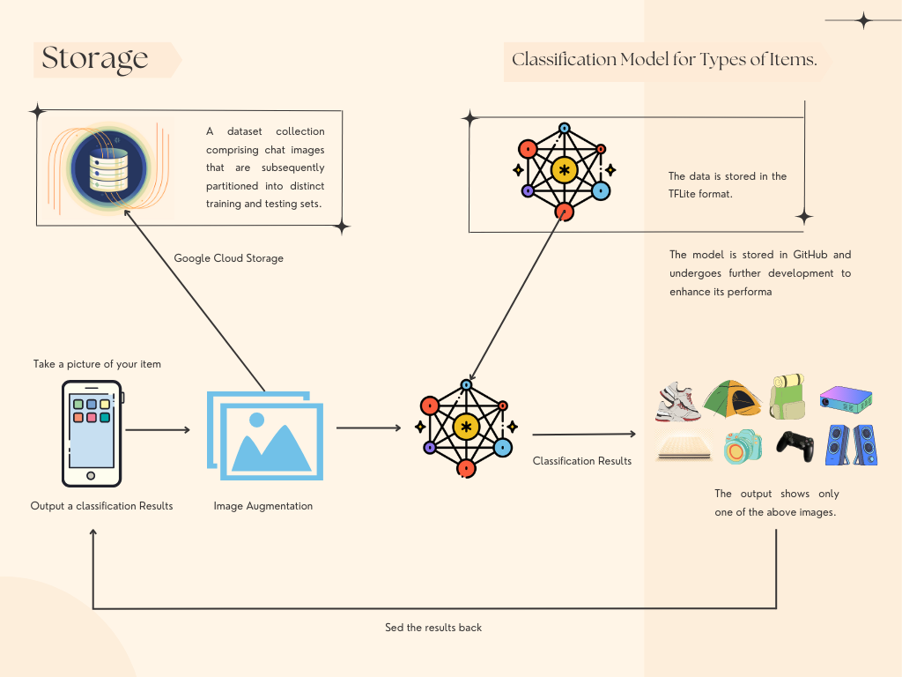

# The Classification Model for Types of Items and Recommendation System.
---

BarKit (Barang Kita) : An Affordable and Effective Short-Term Goods Rental Application that utilizes a category matching feature with image recognition using CNN or Image Classification algorithm. It includes a recommendation system based on content-based filtering to suggest items according to user preferences.

## The Team
Project Team Members:
1. (ML) M281DSY2306 – Andi Illa Erviani Nensi – Makassar State University 
2. (ML) M177DSX0401 – Awang Mulya Nugrawan –  Hasanuddin University 
3. (ML) M163DSX3465 – Naufal Mahardika Putra Rumdani – Dian Nuswantoro University 
4. (CC) C177DSX0867 – Muhammad Thoriq Ali Said – Hasanuddin University 
5. (CC) C151DSY3280 – Dian Ayu Rahmawati – Brawijaya University 
6. (MD) A366DSX3591 – Robby Alamsyah – Trunojoyo University

## What's in this repo?

## Dataset
For feature 1, images were randomly collected from the internet, ensuring they are suitable for the model. For feature 2, data was gathered from a publicly available source on the internet, and a dummy dataset was created.

1. Kaggle Dataset URL: https://www.kaggle.com/code/ebruzumruttas/recommendation-engine-for-e-commerce-company

Kaggle Dataset: by ___ Description

## Classification Workflow
### Classification Model

### Recommendation System Model

## Timeline and Master Plan Fitur 1 and 2
Stage 1: Dataset and Pre-Processing
We are gathering the necessary dataset for model training. We are also organizing and cleaning the data collection for each breed, removing irrelevant or damaged images to avoid overfitting/underfitting or any potential degradation in model performance. We are ready for further processing and will store the images at a large scale using Google Storage and Google Drive, making the dataset accessible to the ML Barkit team. The dataset for Feature 1, which is Classification of item types, will be separated into training and testing subsets. For Feature 2, which is System Recommendation, the data will be divided into training and testing sets.

Stage 2: Build and Train Model
We will select and design a suitable Deep Learning architecture for the given task. We will also build and configure the model's layers, such as convolutional layers, hidden layers, etc. Next, the model will be trained using the training subset of the dataset. Finally, we will validate and evaluate the performance of the model using a dedicated validation subset, particularly for Feature 1, which is the primary feature, i.e., classification of item types.

Stage 3: Optimizing Model
During the model optimization phase, we identify areas where the model can be enhanced and optimized. We then implement techniques such as hyperparameter tuning, utilizing improved activation functions, regularization, or dropout to enhance the model's performance. Additionally, at this stage, we devise strategies to prevent overfitting or underfitting and select an appropriate optimization method, such as Stochastic Gradient Descent (SGD) or a suitable algorithm.

Stage 4: Deployment Preparation
At this stage, we ensure that the trained Deep Learning model is ready for implementation in a production environment. We conduct thorough testing of the model on a separate testing dataset to ensure its performance meets expectations. Additionally, we prepare the necessary code and infrastructure to provide interfaces that enable real-time usage of the model. Furthermore, we convert the model to TFLite or TFjs format and ensure it is ready for deployment.